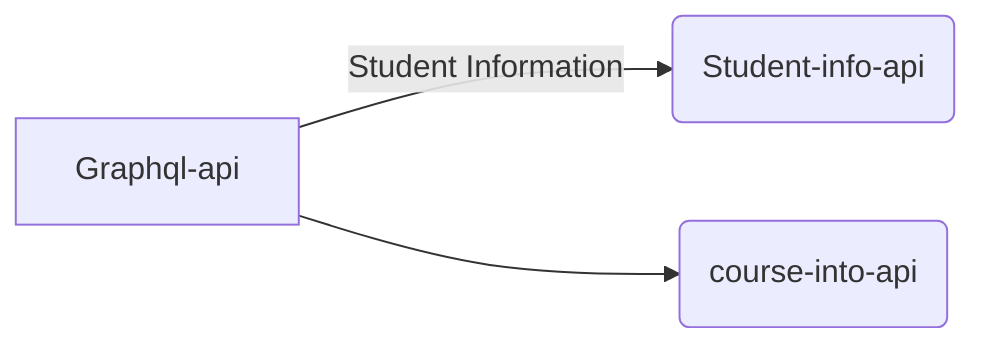

# Graph QL Dot Net Core Sample

This is a Graph QL api written in C# dot net Core 2.2 to demonstrate how to write get data from two different rest api(micro services). There are two 

# Dependencies
1. GraphiQL - Provides the GraphQL web interface for testing
2. GraphQL - Library to provide the GraphQL query support
3. RestSharp - To Make http rest calls to other api

# Projects
There  are 3 projects in the solution and they are mentioned below
- GraphQL-api-orch
- CourseInfo-api-microservice

   This provides information about the courses like the name of the course and the id
- StudentInfo-api-microservice

   This provides the student information like the student id, student name, address and the courses id the student is enrolled in.

# UML diagrams

